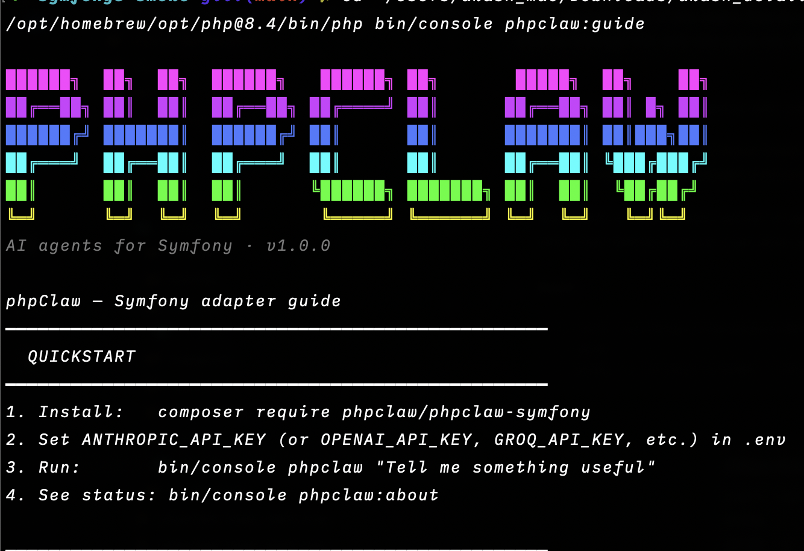
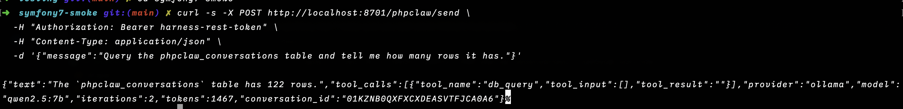

<p align="center">
    
    
</p>

<p align="center">
<a href="https://www.php.net"></a>
<a href="https://symfony.com"></a>
<a href="LICENSE"></a>
<a href="https://packagist.org/packages/phpclaw/phpclaw-symfony"></a>
<a href="https://github.com/phpclaw-php/phpclaw-monorepo/actions/workflows/symfony.yml"></a>
<a href="https://packagist.org/packages/phpclaw/phpclaw-symfony"></a>
</p>

> **This is a read-only mirror**, auto-published from [`phpclaw-monorepo`](https://github.com/phpclaw-php/phpclaw-monorepo). Please open issues and pull requests there, not here.

<h1 align="center">Give your Symfony app an agent, not a chatbot.</h1>
<p align="center">phpClaw is the AI layer for Symfony: bundle, console, Doctrine, all native.</p>

---

Most "AI in Symfony" setups mean gluing an HTTP client to your app and hoping the prompt holds up. phpClaw is a real bundle: autowired as a service, driven by the console, backed by Doctrine, with tools that actually query your database instead of guessing.

Ask it something and it picks a tool, runs it against your live app, and answers with real data. No fine-tuning, no separate service to run.

## Just ask

```
> How many users signed up this week?
> Tail the last 50 lines of the log at warning level
> Summarise today's error log
> What's the total in the orders table this month?
```

## CLI



The agent from your terminal, scriptable and CI-friendly:

```bash
bin/console phpclaw "how many users signed up this week?"
bin/console phpclaw "tail the last 50 error-level log lines" --stream
```

## Programmatic use

Autowired via the container. Inject `ClawInterface` anywhere:

```php
use PhpClaw\Contracts\ClawInterface;

class DashboardController extends AbstractController
{
    public function __construct(private readonly ClawInterface $phpclaw) {}

    public function summary(): JsonResponse
    {
        return $this->json(['summary' => $this->phpclaw->send('Summarise this week\'s signups.')->text]);
    }
}
```

## REST API



Declared in `config/routes.yaml`, prefixed `/phpclaw`:

```
POST /phpclaw/send                          synchronous agent run
POST /phpclaw/chat/stream                   streamed response
```

**The REST API needs `symfony/security-bundle`, which this package only suggests.** Install it and
put a firewall over `/phpclaw`, or every call answers 401. That is correct behaviour, not a
misconfiguration: every conversation is stored against the acting user identifier, so there has to
be one.

Both require an authenticated user: a request without one is rejected with 401. Point `security.yaml` at whichever
firewall protects the `/phpclaw` prefix. By default any authenticated user reaches the agent and its
tools; set `require_chat_role: true` to demand `ROLE_PHPCLAW_CHAT` instead. `ROLE_PHPCLAW_MANAGE_ALL`
grants two things together: reading every user's conversations, and the raw read-only SQL tool, which
always requires that role.

## Installation

```bash
composer require phpclaw/phpclaw-symfony
```

Symfony Flex registers the bundle for you. Copy the config, set a provider key in `.env`, then run:

```bash
bin/console phpclaw "hello"
```

Full setup, configuration, and provider options are documented at [phpclaw.ai/docs/adapters/symfony](https://phpclaw.ai/docs/adapters/symfony).

## Key features

✅ **Native console commands**: `phpclaw`, `phpclaw:mcp-server`, `phpclaw:about`, `phpclaw:guide`, `phpclaw:stats`, `phpclaw:jobs:list`, `phpclaw:jobs:status`

✅ **Doctrine-backed memory**: conversation + key-value drivers via DBAL, plus a cache-store driver

✅ **2 Symfony-native tools**: database (read-only SELECT via Doctrine DBAL), log tail (`var/log/*.log`)

✅ **Web Profiler integration**: a dedicated data collector panel for every agent run

✅ **REST API**: routes ship enabled (`PHPCLAW_API_ENABLED` defaults to `true`); set it to `false` and both answer 403. Two endpoints: `send` and `chat/stream`

✅ **Multiple AI providers**: Anthropic, OpenAI, Groq, Gemini, Mistral, DeepSeek, Ollama, and any custom OpenAI-compatible endpoint

✅ **Conversation memory**: context carries across a session by default

### How it fits together

```
Symfony → phpClaw Symfony bundle (PhpClawBundle) → phpClaw agent runtime → your configured AI provider
```

## Documentation

This README gets you installed. Everything else (configuration, providers, memory, skills, Cloud, the full tool reference, REST API, CLI, code examples, upgrading, troubleshooting) lives at:

**[phpclaw.ai/docs/adapters/symfony](https://phpclaw.ai/docs/adapters/symfony)**

## Contributing

Contributions are welcome. See the [contributing guide](https://phpclaw.ai/docs/contributing).

## Security

Please review our [security policy](https://github.com/phpclaw-php/phpclaw-monorepo/security/policy) for reporting vulnerabilities.

## License

MIT. See [LICENSE](LICENSE). Part of the [phpClaw](https://github.com/phpclaw-php/phpclaw-monorepo) project.

Symfony is a trademark of Symfony SAS. phpClaw is an independent open-source project and is not affiliated with or endorsed by Symfony SAS.
